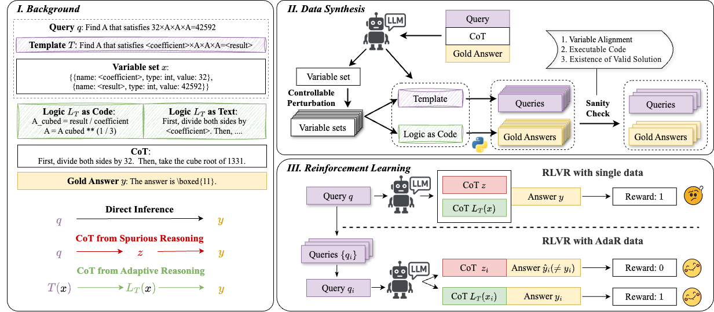

# Making Mathematical Reasoning Adaptive

<p align="center">
  <a href="https://arxiv.org/abs/2510.04617"> 📃 Paper</a> | 
  <a href="https://github.com/NJUNLP/AdaR"> ⚙️ Code</a> | 
  <a href="https://huggingface.co/collections/DreamW1ngs/adar-68e648e59b2c9aec1208b5ef"> 🤖 Project</a> | 
  <a href="https://resume.laizj.fun/"> 📭 Contact</a> 
</p>

---

## 🌱 Overview

Large Language Models (LLMs) have shown impressive reasoning capabilities, yet they often rely on **spurious reasoning** — producing answers from superficial features, leading to failure at robustness and generalization.

We propose **AdaR** framework to enable adaptive reasoning, wherein models rely on problem-solving logic to produce answers. **AdaR** synthesizes logically equivalent queries by varying variable values, and trains models with RLVR on these data to penalize spurious logic while encouraging adaptive logic.

The framework integrates *data synthesis* and *RLVR training* to enhance both **robustness (in-domain)** and **generalization (out-of-domain)**.



> **Figure 1.**  
> *Subfigure I:* Three reasoning modes — direct inference (black), spurious reasoning (red), adaptive reasoning (green).  
> *Subfigure II:* Logic-preserving variable perturbation and gold-answer generation via executable logic.  
> *Subfigure III:* RLVR optimization encouraging adaptive reasoning through comparative feedback.

## 📈 Highlights

- 🚀 **+8.5 Average Improvement** across in-domain robustness tasks and out-of-domain tasks.
- 🧮 **Only 9K synthetic data** needed for significant gains.
- ⚖️ **Enable algebraic thinking** and improved stability under scaling.
- 🔁 **Generalizable framework** applicable to instruct models.

---

## Instructions for **AdaR**

### ⚙️ Installation

```bash
git clone https://github.com/LaiZhejian/AdaR.git
cd AdaR
uv sync
```

### 📂 Data Preparation

AdaR expects data in **JSONL format**, with each line as:

```json
{
  "query": "The math problem statement",
  "chosen": "The chain-of-thought reasoning",
  "answer": "The gold standard answer"
}
```

| Field | Description |
|--------|--------------|
| `query` | Input math problem |
| `chosen` | Chain-of-thought reasoning |
| `answer` | Ground-truth answer |

### ⚙️ Configuration

Modify parameters in **`scripts/config.yaml`**:

- `is_parallel`:  
  - `true` → Parallel querying (API-based).  
  - `false` → Sequential querying (local).

You may adjust hyperparameters according to your dataset and model choice.

### 🔧 Running Data Synthesis

Once configuration is set:

```bash
bash synthesis.sh
```

This script will launch the **AdaR** data synthesis and RLVR training pipeline.

---

## 📜 Citation

If you find this repository helpful, please cite:

```bibtex
@misc{lai2025makingmathematicalreasoningadaptive,
      title={Making Mathematical Reasoning Adaptive}, 
      author={Zhejian Lai and Xiang Geng and Zhijun Wang and Yang Bai and Jiahuan Li and Rongxiang Weng and Jingang Wang and Xuezhi Cao and Xunliang Cai and Shujian Huang},
      year={2025},
      eprint={2510.04617},
      archivePrefix={arXiv},
      primaryClass={cs.AI},
      url={https://arxiv.org/abs/2510.04617}, 
}
```

---

<p align="center">
  <b>⭐️ If you find AdaR helpful, please give this repo a star!</b><br>
  Designed for robust and interpretable mathematical reasoning.
</p>
